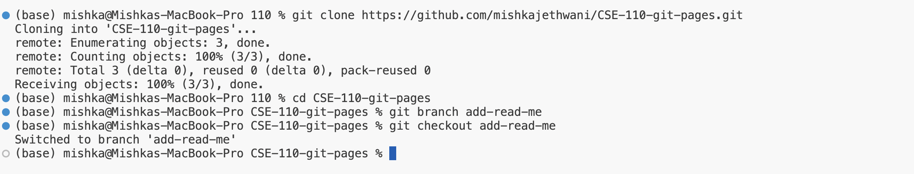
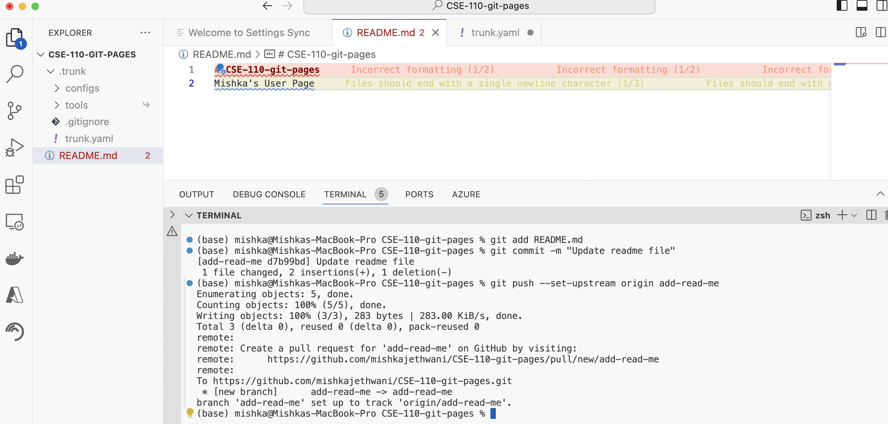
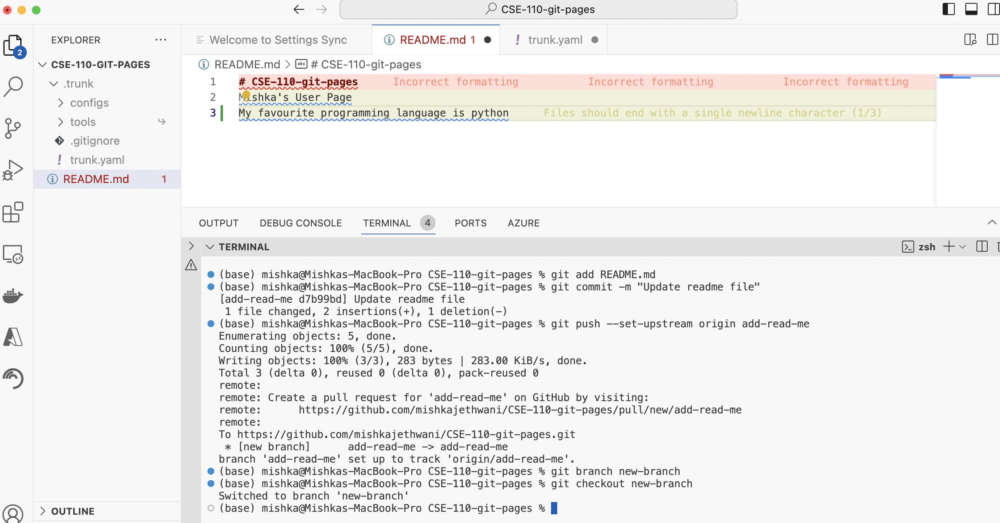
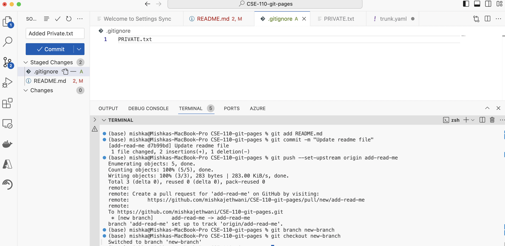

# Mishka Jethwani


## List of Contents
[About Me](#about-me)

[Technical Skills](#technical-skills)

[Lab](#lab)


#### About Me

Hi! I am *Mishka Jethwani*. I am a second year **CE** major at ***UC San Diego***. 

Here's some intresting facts about me! 
- The first time I came to the US was two years back to UCSD
- Python is my favorite programming language and the first bit of code that I wrote in it, like many other programmers was:
``` print("Hello World") ```
- One of my favourite quotes is
> "Yesterday is history, Tomorrow is a mystery but today is a gift that is why it is called a present"
>
>  -Master Oogway, Kung Fu Panda
- I love travelling and want to exlore US more as it is my first time here, But I have travelled to a lot of places outside the US


My top favorite destinations I have been to are: 
1. Switzerland
2. Austria
3. Paris

My US Bucket List is: 
- [x] Golden Gate Bridge
- [ ] Grand Canyon
- [ ] Disney World

#### Technical Skills
- Languages: Python, Java, C, C++, JavaScript, HTML, CSS
- Frameworks: Django, Express, Node.js, Next.js 13, React, Tailwind CSS, Convex Developer
- Tools: Jupyter Notebooks, Git, Vim, MATLAB
- Libraries: OpenCV, Numpy, Pandas, Pytorch, Tensorflow, Keras
If you would like to know more about me. Heres my [LinkedIn](https://www.linkedin.com/in/mishka-jethwani-791246282/)

#### Lab
Here is what I worked on in this Lab: 








You can see the README files for the following branches, 


[main](README.md)

[add-read-me](../add-read-me/README.md)

[new-branch](../new-branch/README.md)


